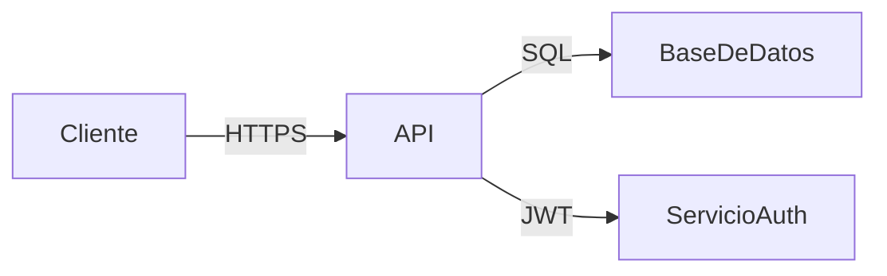
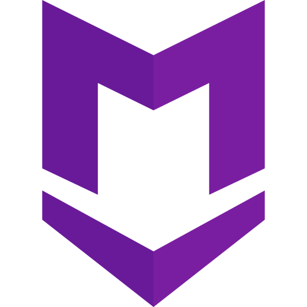

# Mi Proyecto Integrador
  

Este proyecto es una aplicación desarrollada para el curso de Diseño de Interfaces de Programación Avanzado.

## Tabla de contenidos
- [Instalación](#instalación)
- [Uso](#uso)
- [Arquitectura](#arquitectura)
- [Contribuidores](#contribuidores)

## Tecnologías

| Tecnología | Versión | Propósito          |
| ---------- | ------- | ------------------ |
| Node.js    | 18.x    | Servidor backend   |
| React      | 18.x    | Interfaz de usuario|
| MongoDB    | 6.x     | Base de datos      |

## Estado del proyecto

- [x] Autenticación de usuarios
- [x] CRUD de tareas
- [ ] Notificaciones en tiempo real
- [ ] Despliegue en producción

## Arquitectura

## Capturas

## Contribuidores

- [@VASQUEZ](https://github.com/VASQUEZ) — Desarrollo y documentación